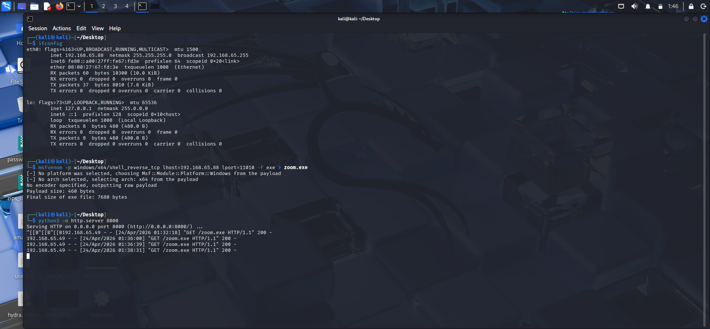
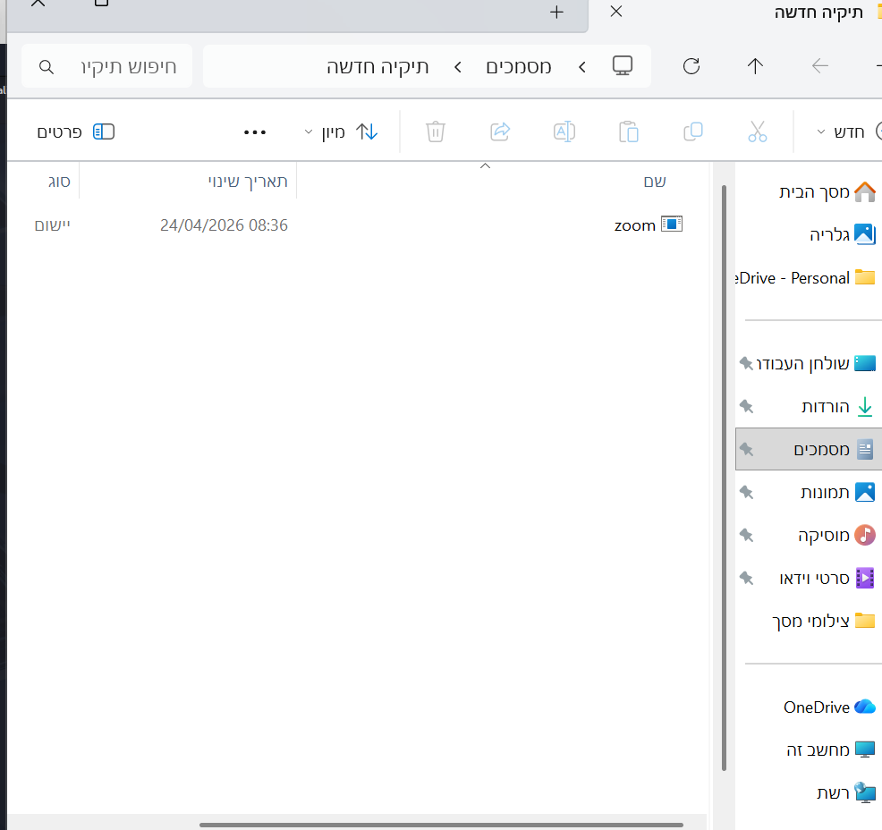
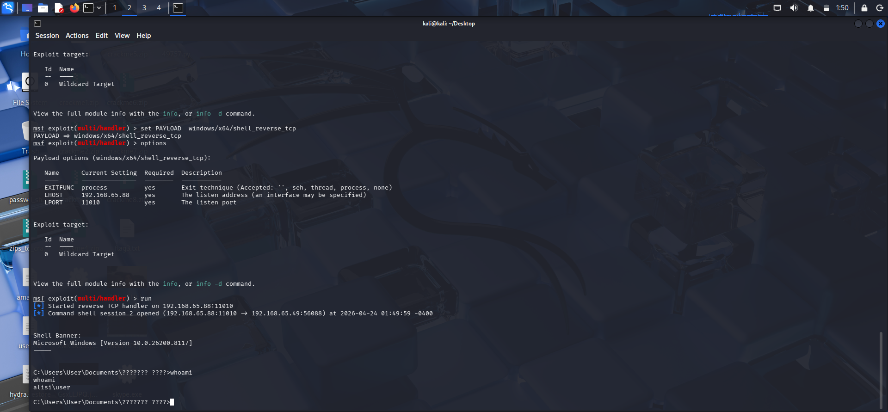
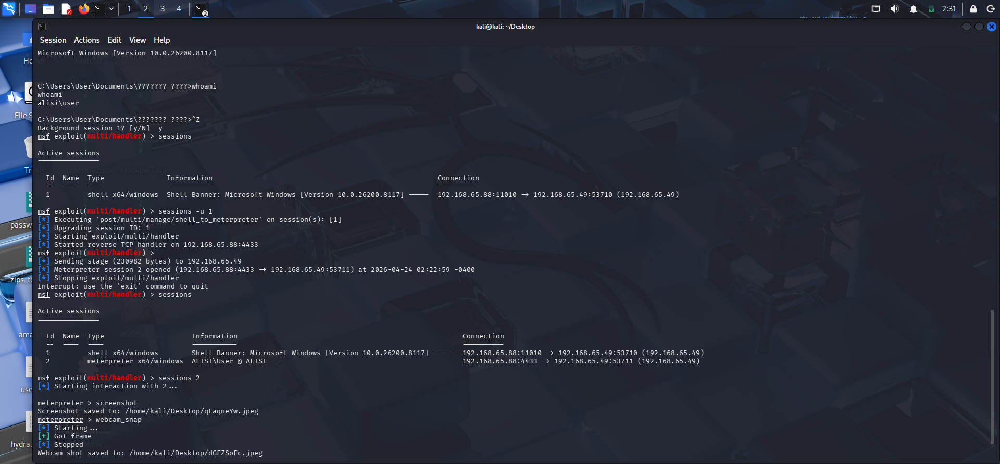
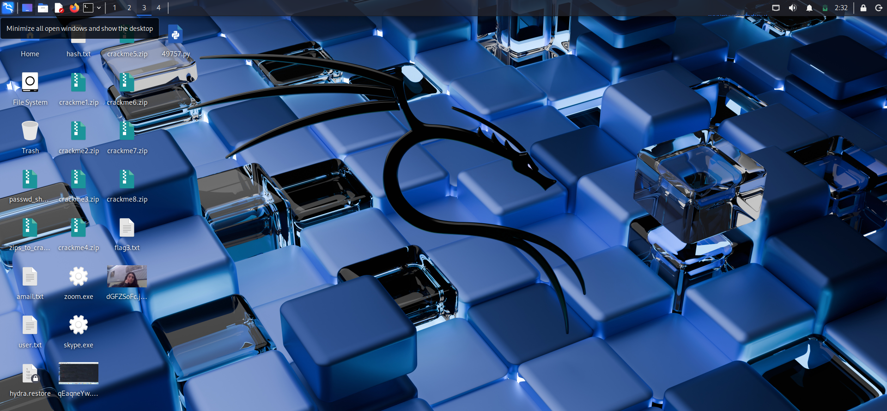

# Windows Post-Exploitation & Meterpreter Lab 🛡️

## 📌 Project Overview
In this lab, I wanted to explore a full attack lifecycle on a Windows machine. My goal was to understand how a seemingly "innocent" file can lead to a complete system compromise and see what an attacker can actually do once they establish a Meterpreter session.

---

## 🚀 Step-by-Step Walkthrough

### 1. Payload Creation & Hosting
I started by generating a malicious executable named `zoom.exe` using `msfvenom`. For this lab, I chose a **Staged Payload** (`windows/x64/meterpreter/reverse_tcp`).
* **Why Staged?** I wanted to simulate a real-world scenario where a small "Stager" is first sent to the victim to open a connection, which then pulls the rest of the complex Meterpreter payload into memory. This helps in keeping the initial file size small and more stealthy.

> **My Note:** I hosted the file using a simple Python HTTP server to simulate a quick delivery method.

---

### 2. Catching the Initial Shell
I configured the `multi/handler` in Metasploit to wait for the incoming connection. As soon as the victim ran the file, the "Stager" did its job and established the connection back to my machine.

> I used `whoami` to confirm the initial access before moving to the next stage.

---

### 3. Upgrading to Meterpreter
Once I had a basic connection, I upgraded the session to **Meterpreter**. Unlike a regular shell, Meterpreter runs entirely in the target's memory (RAM) and doesn't create new processes, which makes it much harder for basic security tools to detect.

---

### 4. Post-Exploitation (Proof of Control)
With the Meterpreter session active, I ran a few commands to show the level of control an attacker gains:
* **Screenshot:** Captured the user's current desktop.
* **Webcam Snap:** Took a photo using the target's camera.
* **System Info:** Extracted OS and hardware details.

> **Conclusion:** This proves that once a Meterpreter session is active, the attacker has nearly total control over the host's hardware and data.

---

## 🔍 Key Takeaways
* **Staged vs Non-Staged:** I practiced using a staged payload to understand how the initial connection (stager) facilitates the delivery of the full stage.
* **In-Memory Execution:** Meterpreter’s ability to reside in memory without touching the disk is a critical concept in modern penetration testing.
* **Social Engineering:** It’s eye-opening how easily a renamed file like `zoom.exe` can bypass a user's suspicion.

## 🛡️ Mitigation Strategies
* **Endpoint Protection:** Use EDR solutions that monitor for suspicious memory injections, not just file signatures.
* **Network Monitoring:** Watch for unusual outbound traffic on ports like 4444.
* **Zero Trust:** Never execute files from unverified sources, even if they look like familiar apps.

## 🛡️ Defensive Mitigations
To prevent such attacks, the following security measures are recommended:
1. **EDR/Antivirus:** Ensure real-time protection is active to catch known malicious signatures (like msfvenom payloads).
2. **User Education:** Avoid downloading and running executable files from untrusted network sources.
3. **Application Whitelisting:** Use policies to ensure only authorized, signed applications can execute.
