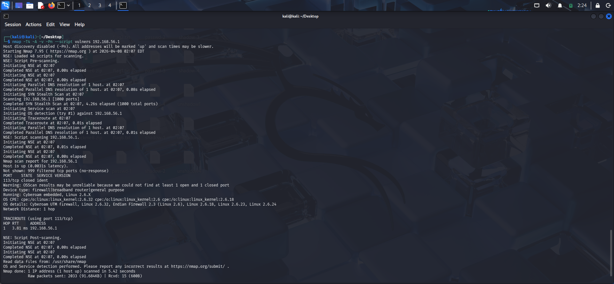
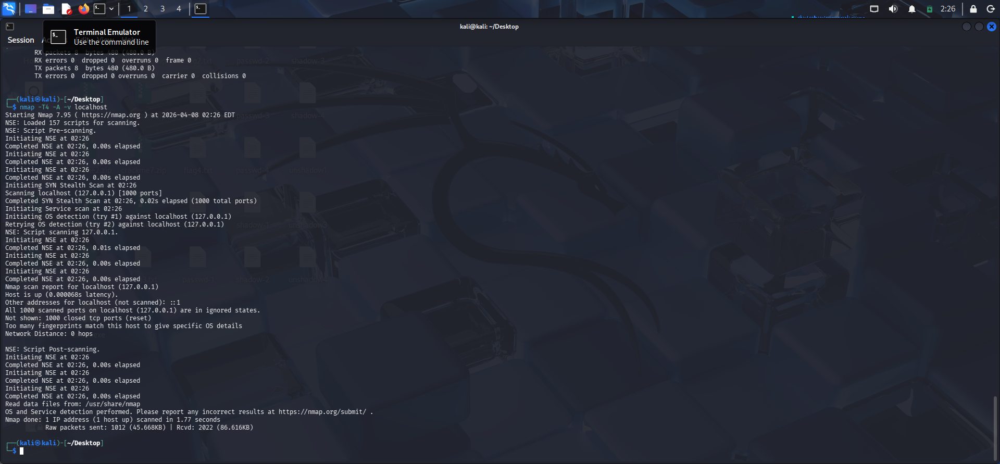

# 🛡️ Network Security Audit: Nmap Reconnaissance Lab

## 🎯 Project Overview
In this lab, I performed a tactical scan to analyze network security postures. I compared a hardened host environment against a local service discovery scenario to understand how firewalls mitigate reconnaissance.

---

## 🔍 Scenario 1: Scanning a Hardened Host
I targeted the host gateway to observe firewall behavior during an aggressive scan.

**Command:**
`nmap -T4 -A -v -Pn --script vulners 192.168.56.1`

**Analysis:**
The scan identified **999 filtered ports**. This confirms that the host is protected by a **Stateful Firewall** that drops unsolicited packets, effectively hiding the attack surface.

---

## 🔍 Scenario 2: Service Discovery (Localhost)
To demonstrate Nmap's capability to identify active services and versions, I performed a scan on the local environment.

**Command:**
`nmap -sV localhost`

**Analysis:**
Unlike the hardened host, the local scan successfully identified open ports and service versions. This is a crucial step in the **Vulnerability Assessment** phase.

---

## 💡 Key Takeaways
* **Firewall Visibility:** Modern security systems use "Filtered" states to remain invisible to scanners.
* **Tool Proficiency:** Demonstrated the use of Nmap flags (`-A`, `-Pn`, `-sV`) and the NSE (Nmap Scripting Engine).
* **Defensive Mindset:** Verified that the host machine is correctly hardened against basic discovery.
